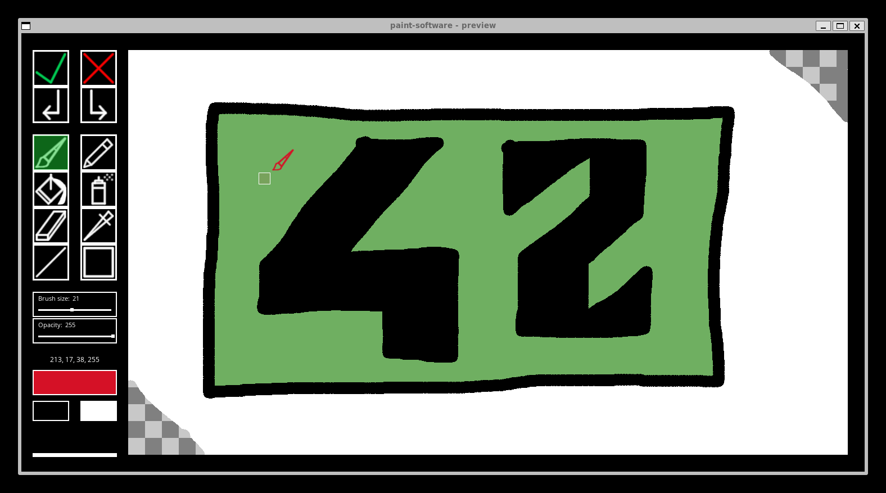

# paint-software
## « Dead Painters Society »



### Overview

The main objective was to create a lightweight drawing application while experimenting with my newly developed `UI` library (see [github.com/pcapurro/sdl-cpp](https://github.com/pcapurro/sdl-cpp)). Developing the application required designing numerous custom widgets, implementing multiple painting tools, building a complex component hierarchy with custom behaviors, and developing a fully asynchronous multi-window system.  

The project is written for Linux. You need the following packages (`SDL2`):  
```
libsdl2-dev libsdl2-ttf-dev libsdl2-image-dev
```

Use `make` to compile the software. Type `./paint-software` to launch.  

At start, the software will ask you the name of your project (the name of the exported `.png` file) and the dimensions (`px`) of your painting.  

Main tools:  
– `Brush` and `pencil`,  
– `Bucket` (span fill algorithm) and `spray`,  
– `Eraser` and `color picker`,  
– `Line` and `square`.  

Others:  
– **Export** (`.png`),  
– **Undo/Redo history** (Ctrl+Z / Ctrl+Y),  
– **Alpha channel** support,  
– **Brush opacity and size** settings slider,  
– **Color selection**.  

You can use `F5` to generate a new color randomly.  

> [!NOTE]  
> The software interface is inspired by Apple's MacPaint (1984).  
> It is an independent implementation and is not affiliated with Apple Inc.  
>
> The software uses the Open Sans typeface by Steve Matteson.  
>
> All the other assets (icons and buttons : see materials/) have been made by myself from scratch using GIMP software.  
